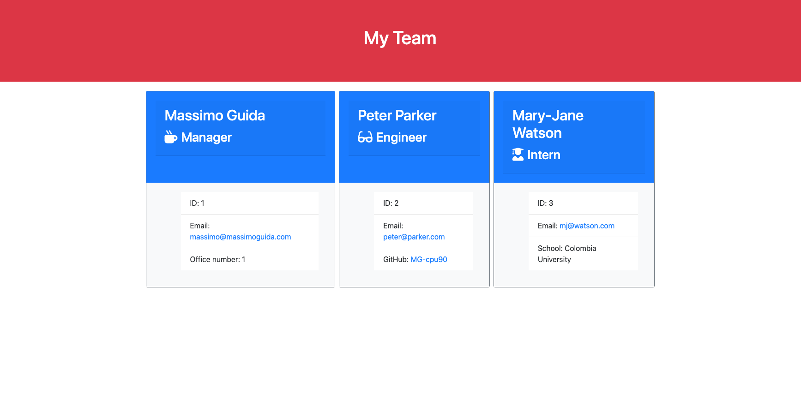

# Assignment 10: Template Engine - Employee Summary

The following application allows a manager to generate a team html page through the CLI by prompting them for a series of questions on professional information about themselves and their employees through node.

## Usage
In order to run the appication: 
* Clone the [GitHub repository](https://github.com/MG-cpu90/assignment10) into a new folder on your computer 
* The repository contains a package.json file, so you will need to run "npm install" in your terminal in order to install the necessary pacakges
* Open the "app.js" file in your terminal window, and type in "app.js" to run the CLI application
* You will be prompted for a series of questions and once they have all been answered, a webpage ("team.html") with inforation about your team will be generated in the "output" folder

### User Story
```
AS a manager
I WANT to generate a webpage that displays my team's basic info
SO THAT I have quick access to emails and GitHub profiles
```

## Bugs (Now Resolved)

* Although the team page is successfully created from the prompts, at the moment, the page only contains the manager and one employee, as I am unsure how to loop the prompts so that more employees can be added to the team

* Moreover, I am unsure how to allow the user to continue with the prompts if the answer of the confirm is "yes," or to end the session if the answer of the confirms is "no"

## Application Screenshot



## Accessories Used
### Languages
* HTML
* CSS
* JavaScript
* [jQuery](https://jquery.com/)
* [Bootstrap CSS Framework](https://getbootstrap.com/)
* [Font Awesome](https://fontawesome.com/)

### Programs and Applications
* [Node.js](https://nodejs.org/en/)
* Git/Terminal

### Packages
* [Express](https://expressjs.com/)
* [jest](https://jestjs.io/)
* Inquirer
* AXIOS
* fs

### Websites
* [GitHub](https://github.com/) (API)

## Deployed links:

* GitHub repository URL: https://github.com/MG-cpu90/assignment10